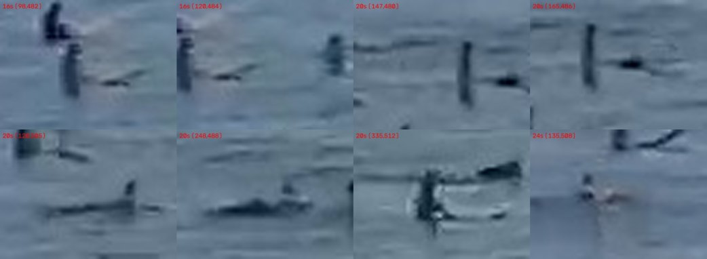

# Zero-shot YOLO surfer detection — measured results

Per-frame surfer detection with stock COCO weights. No training, no labelling,
no temporal tracking.

**Headline: it works, and the errors are all misses.** At conf ≥ 0.15 it produces
**zero false positives** across the evaluated frames, at 65% recall. Drop to
conf 0.05 and you get **77% recall at 86% precision**. Every failure is a surfer
it didn't find, not a wave it mistook for one.

That is the opposite of the classical baseline, which produced ~550 false
positives per frame. It also makes the remaining gap a tractable one.

## Setup

`yolo11m.pt`, stock COCO weights, zero-shot. COCO already has `person` (0) and
`surfboard` (37), so no training was needed to get started.

The only real obstacle is scale. Surfers here are **10–20 px** in a 1920×1080
frame. Fed a whole frame at `imgsz=640`, the model downscales them to ~5 px and
finds almost nothing:

| inference | detections |
|---|---|
| full frame, imgsz=640 | 5 |
| full frame, imgsz=1920 | 8 |
| tiled 384→768 (2× upscale) | 15 |

So the frame is sliced into small tiles, each upscaled to the model's input.
A 15 px surfer arriving as ~60 px is a completely different proposition.

**Upscale factor is the dominant knob** — more than model size or threshold.
Sweeping it against a cluster with ~11 known surfers:

| tile → imgsz | upscale | conf | found in cluster |
|---|---|---|---|
| 384 → 768 | 2× | 0.05 | 10 |
| 256 → 768 | 3× | 0.05 | 7 |
| **192 → 768** | **4×** | **0.05** | **12** |
| 256 → 1024 | 4× | 0.05 | 9 |

Note it is not monotonic — 3× scores worse than both 2× and 4×. Tile size and
upscale interact (a 256 px tile splits this cluster awkwardly), so this is worth
re-sweeping rather than reasoning about, if the framing changes.

Chosen config: **tile 192, overlap 48, imgsz 768, conf 0.05–0.15**.

### A bigger model is worse, not better

Worth knowing before anyone reaches for it. `yolo11x` (109 MB) against
`yolo11m` (39 MB), same tiling, same frames:

| model | conf | precision | recall | F1 |
|---|---|---|---|---|
| yolo11m | 0.05 | **0.86** | **0.77** | **0.81** |
| yolo11x | 0.05 | 0.61 | 0.71 | 0.66 |
| yolo11m | 0.15 | **1.00** | 0.65 | 0.78 |
| yolo11x | 0.15 | 0.76 | 0.52 | 0.62 |

`yolo11x` is worse on *both* axes at every threshold — it finds fewer real
surfers and invents far more (19 false positives at conf 0.02, against 4 for
`yolo11m` at 0.05). The zero-false-positive property is specific to the medium
model, not a general property of scaling up.

These objects are far outside COCO's distribution, so more capacity mostly buys
more confident wrong answers on upscaled wave texture. Convenient outcome: the
model that works is also the cheaper one, and it is ~3× faster on CPU.

### One implementation detail that matters a lot

Boxes from neighbouring tiles need merging **twice**: IoU NMS, then a second
pass by centre distance. IoU NMS alone leaves a torso box and a torso+board box
on the same surfer un-suppressed, because small offset boxes barely overlap.
Before adding the distance pass, one frame reported 14 detections where there
were 8 surfers — a near-doubling that would have quietly corrupted every count.

## Ground truth

Hand-labelled, in `groundtruth.json`: 3 frames from one dwell (camera static to
<0.5 px), 31 surfers total.

Labelling at this resolution is genuinely hard, so two things were done to keep
it honest:

- Labels were made at 5–6× zoom using a **3-frame filmstrip** as an aid — a real
  surfer persists and drifts smoothly between frames, wave texture does not.
  (Temporal information is used *only* to build ground truth, never by the
  detector.)
- Blobs that still could not be resolved confidently are marked **`ambiguous`**
  and excluded from both TP and FP. A detection landing on one is neither
  rewarded nor punished. There are 2 per frame.

The whole water band (y 180–860) was scanned, not just the cluster, so misses
outside the crowd would be caught. Outside the main cluster the water held only
two surfers, both found.

## Results

`python -m surfcam.eval_detector <frames>` — matching is greedy nearest-centre
within 22 px, not IoU (at 10–20 px the box extent is dominated by whether the
model included the board, which makes IoU far noisier than "did it find this
surfer").

| conf | GT | det | TP | FP | FN | precision | recall | F1 |
|---|---|---|---|---|---|---|---|---|
| 0.05 | 31 | 30 | 24 | 4 | 7 | 0.86 | 0.77 | **0.81** |
| 0.10 | 31 | 26 | 23 | 3 | 8 | 0.88 | 0.74 | **0.81** |
| 0.15 | 31 | 20 | 20 | **0** | 11 | **1.00** | 0.65 | 0.78 |
| 0.25 | 31 | 12 | 12 | 0 | 19 | 1.00 | 0.39 | 0.56 |
| 0.40 | 31 | 9 | 9 | 0 | 22 | 1.00 | 0.29 | 0.45 |

Per frame at conf 0.10: 16s → TP 8 / FP 1 / FN 2; 20s → TP 6 / FP 0 / FN 5;
24s → TP 9 / FP 2 / FN 1.

The frame-to-frame spread (6–9 found out of ~10–11 present) is worth noting: a
single frame's count is noisy even though the scene barely changes across 8
seconds. Counts should be pooled over a dwell, not taken from one frame.

Runtime is ~70 s/frame for the 4× config on CPU (63 tiles). Trivially
parallel and far faster on a GPU, but at ~30 s of usable dwell per preset per
2-minute cycle, even CPU roughly keeps up if you sample a few frames per dwell.

## What it misses



Every miss at conf 0.10, cropped. Two clear categories:

1. **Prone paddlers** — a body lying flat on a board is a horizontal dark
   streak with no upright human silhouette at all. COCO's `person` prior is
   upright bipeds, so these get nothing. This is the single biggest bucket.
2. **Featureless dark columns** — a torso sitting low with no separable head or
   arms. Honestly ambiguous to a human labeller too.

One miss (335,512) is a clear sitting surfer that simply fell just under
threshold — it was detected at conf 0.07.

This is a well-defined, narrow gap, which is the useful part: it says a
fine-tune has something specific to learn, rather than the whole task being
marginal.

## Reading this

**Good news.** Zero false positives at moderate confidence means the model is
not firing on wave texture, whitewater, or glare — precisely what defeated the
classical approach. Wave crests were the thing that made background subtraction
unusable, and the learned model simply ignores them. Counts will be
*underestimates*, not noise, which is a far easier error to live with: it is
biased in a known direction and largely correctable.

**Caveats, and they're real.**

- **31 surfers, 3 frames, one dwell, one lighting condition.** This is a
  feasibility signal, not a validated accuracy figure. Overcast late-afternoon
  light with calm-ish surf; glare, chop, and big whitewater days are all
  untested, and whitewater is the most likely source of the first real false
  positives.
- **The recall number is only as good as my labels.** I labelled these myself
  from a compressed stream at 6× zoom, and marked the genuinely unresolvable
  ones ambiguous rather than guessing. Someone who knows this break would label
  it better.
- **Crowd density is the hard case.** Frame 20, the most tightly packed, scored
  worst (6/11) — overlapping surfers merge or get suppressed. Since crowd size
  is a variable you want to correlate, recall that *falls* as the lineup fills
  up is a systematic bias, not just noise. Worth measuring before trusting any
  crowd-vs-conditions result.

## Next, in order of value

1. **Fine-tune on prone paddlers.** The gap is specific and the fix is cheap:
   a few hundred labelled crops, mostly of prone bodies on boards, should close
   most of the 23–35% miss rate. Use the zero-shot detector at conf 0.05 to
   pre-populate boxes and hand-correct — much faster than labelling from
   scratch, and now genuinely useful since precision is already high.
2. **Validate across conditions** before trusting counts — a glare morning and
   a big messy day, at minimum.
3. **Then add temporal tracking.** Deliberately out of scope here, but it
   addresses exactly the residual errors: pooling across a dwell fixes the
   frame-to-frame count noise, and a track requirement would let the confidence
   threshold drop to 0.05 for recall without paying the precision cost.
4. Quantify the crowd-density recall bias.

## Reproducing

```bash
pip install -r surfcam/requirements.txt

python -m surfcam.yolo_detect   <frames> --out /tmp/vis   # detect + preview
python -m surfcam.eval_detector <frames>                  # scored table above
```

Weights download automatically on first use.
