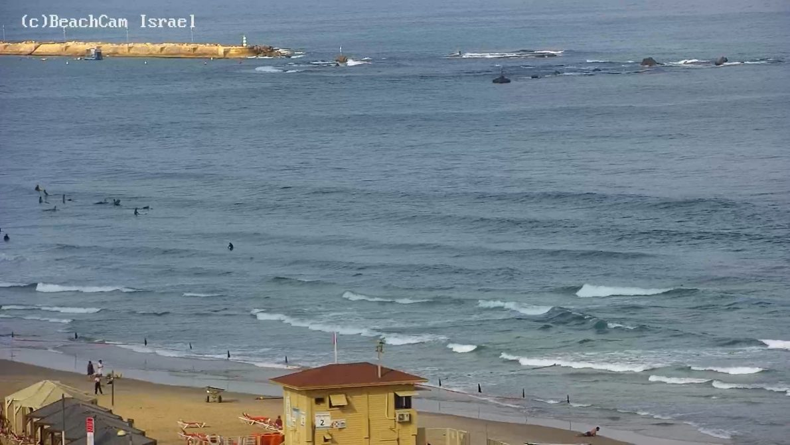
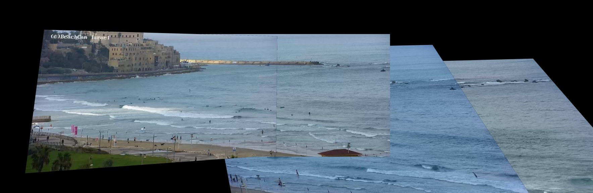
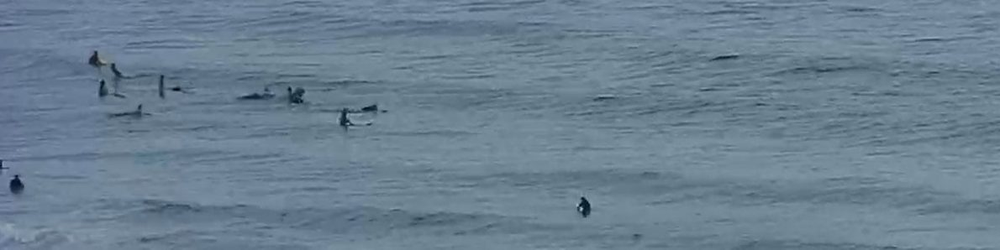
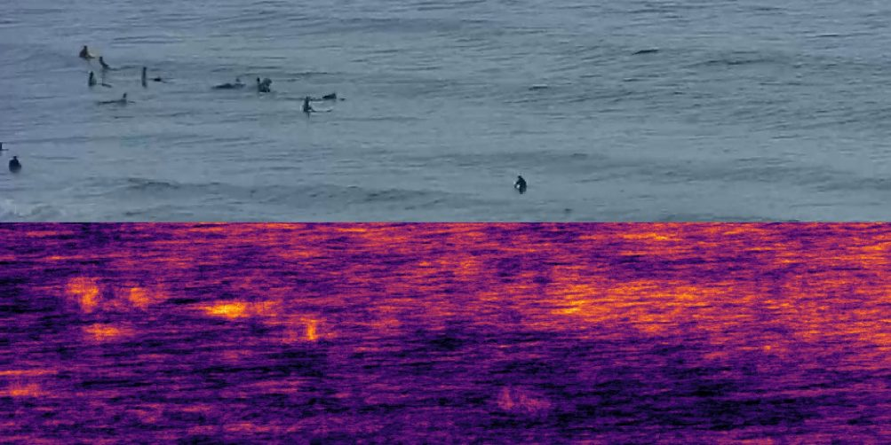

# Surfer detection on the Jaffa cam — feasibility notes

Findings from a first look at the `yafo` feed, plus a proposed design. Everything
in the "Measured" sections came from ~8 minutes of captured video on
2026-08-19; the "Proposed" sections are design, not results.

The camera is `yafo` in `stream_url.json`, scraped from `beachcam.co.il/yafo.html`.
Stream is **1920×1080 H.264 @ 25 fps**, HLS with 2-second segments.



## Measured: the camera runs a preset tour

This is the single most useful thing to know, and it changes the design.

The camera is not continuously rotating. It runs a repeating tour: it pans for
several seconds, then **dwells, dead still, for 5–27 seconds**. Per-second
motion of the image centre across a 7-minute capture:

| state | duration | cumulative pan |
|---|---|---|
| MOVE | 6 s | −470 px |
| DWELL | 8 s | −470 px |
| MOVE | 13 s | −1342 px |
| DWELL | 27 s | −1338 px |
| MOVE | 14 s | −1705 px |
| DWELL | 15 s | −1706 px |
| MOVE | 13 s | −2345 px |
| DWELL | 25 s | −2348 px |
| MOVE | 9 s | −1931 px (returning) |

So: roughly **5 preset positions**, total sweep ≈2350 px ≈ 2.2 frame widths.

During a dwell the frame-to-frame motion is **under 0.5 px** — typically 0.1 px.
That is worth emphasising: within a dwell the camera is static for practical
purposes, so background subtraction and frame differencing work directly, with
no stabilisation step.

Two consequences:

1. **Calibrate per preset, once — don't track continuously.** Cluster frames by
   pan offset into a handful of presets, rather than solving a continuous
   pose-tracking problem.
2. **Detection only runs on dwell frames.** Transition frames get dropped.
   Roughly 60% of wall-clock time is dwell, so the duty cycle is decent, but the
   sampling is intermittent and the statistics have to account for it (see
   [Sampling bias](#sampling-bias)).

## Measured: the motion is a pure rotation, so a homography is exact

Frame-to-frame homographies (ORB + RANSAC) fit with **sub-1.3 px residuals** and
scale ≈1.000 during dwells. Warping the five presets into one canvas by chaining
those homographies produces a coherent panorama — the breakwater and shoreline
run continuously across the preset seams, with no depth-dependent ghosting:



That confirms the camera rotates about (near enough) its optical centre. It
matters more than it might look: **for a pure rotation the image-to-image map is
a homography for every scene point regardless of distance.** There is no
parallax term, so registration needs no depth model and no knowledge of where
the camera is. If the camera also translated, this would be a much harder
problem.

The visible drift and skew toward the right of that panorama is accumulated
chaining error, not a failure of the model — see the caveats in `mosaic.py`.

## Proposed: the image→world projection

Split it in two, because the halves have very different lifetimes:

```
live frame --H_pose--> panorama --H_sea--> world (metres at sea level)
```

- **`H_pose`** changes whenever the camera moves. Estimated automatically per
  frame from rigid land features. Exact, per the rotation argument above.
- **`H_sea`** is fixed and calibrated **once, by hand**. The sea surface is a
  plane, and a plane maps to its image by a homography, so ≥4 correspondences
  between panorama pixels and known real-world points at sea level determine it.

The point of the split is that the expensive manual step happens once against a
static mosaic, and every frame inherits it for free.

Implemented in `project.py` (DLT with Hartley normalisation, plus reprojection
error and a ground-resolution map). It has a synthetic self-test, so the algebra
is verified before any real landmark coordinates exist:

```
python -m surfcam.project
```

### Calibration landmarks

Read coordinates off satellite imagery (OSM/Google), convert to UTM 36N, pair
with panorama pixels. In rough order of usefulness:

- the breakwater's outer corner and its beacon
- the root of the breakwater where it meets the shore
- groyne tips along the beach
- fixed shoreline structures (the lifeguard tower base)

Spread them widely in both range and bearing. Four near-collinear points along
the shoreline will be badly conditioned and the fit will look fine while being
wrong offshore.

### Three things that will bite

**Use the waterline, not the centroid.** The homography is only valid at z=0. A
surfer standing ~1.5 m above the water back-projects as though they were much
further out. Take the bottom of the detection box.

**Accuracy collapses with distance.** The view is grazing, so one pixel spans
far more ground offshore than inshore. The self-test shows the amplification
concretely: **0.5 px of landmark error → 2.3 m of world error** in that geometry,
and it grows without bound toward the horizon. Publish a per-pixel resolution
map alongside any positions, and threshold on it (`usable_mask`) rather than
quietly reporting positions that are meaningless. Take-off *positions* near the
outer break will be much less trustworthy than positions in the inside section.

**Tide moves the plane.** The Mediterranean is microtidal (~±0.2 m), so this is
second-order — but tide is one of the variables you want to correlate against,
which makes a tide-dependent bias exactly the kind of error that manufactures a
spurious correlation. Worth modelling as a vertical offset on the sea plane
rather than ignoring.

One more: estimate `H_pose` from **land features only**. Water is non-rigid and
will drag the estimate around. `motion.land_mask` is the hook for this.

## Measured: detection is the hard part

Surfers are **10–20 px wide, 5–12 px tall** — a dark torso blob plus a pale
board streak, at modest contrast:



I tried two classical approaches on a 23-second dwell. Both fail:

| approach | result |
|---|---|
| median-background differencing | ~750 blobs/frame |
| black top-hat + temporal persistence | ~550 blobs/frame |

The persistence map (bottom) versus the frame (top) shows why:



The surfer cluster on the left *does* light up — the signal is real. But wave
crests are quasi-stationary over tens of seconds and are the same 10–20 px
scale, so they light up comparably. "Small, dark, and persistent" describes a
wave crest as well as it describes a surfer. No amount of threshold tuning
separates them, because they are not separable in those features.

**So: use a learned detector.** Classical CV is not going to carry this.

## Proposed: the detection pipeline

1. **Slice the frame.** At 10–20 px, surfers are far too small for a detector
   fed a downscaled 1080p frame. Run tiled/sliced inference (SAHI-style) on
   overlapping crops so the objects occupy a usable fraction of the input.
2. **Fine-tune a small YOLO** on a few hundred hand-labelled dwell frames.
   Restrict to the water band; the beach has actual pedestrians that are easy
   confusers.
3. **Bootstrap the labels with `detect.py`.** It is not a detector, but it does
   concentrate candidates into ~500 boxes out of ~2M pixel locations, which is
   enough of a reduction to make labelling practical. Keep the top-hat response
   as an extra input channel — it is cheap and it suppresses broad wave shading.
4. **Track across the dwell.** A real surfer persists and drifts smoothly; a
   wave-crest false positive does not. Requiring a coherent short track is
   likely to remove more false positives than any per-frame tuning, and it is
   what turns detections into the events you actually want.

### Getting take-offs specifically

Take-off is a *state transition*, not an object class. Classify each track:

- **sitting/waiting** — near-stationary, bobbing
- **paddling** — slow, roughly shore-normal motion
- **riding** — fast shoreward motion, with whitewater appearing alongside

A take-off is the paddling→riding transition. Log its **time and world position**;
that gives the take-off-location distribution you're after, and the ride length
falls out of the track for free.

Note this is much more robust than per-frame detection, because a transition is
defined over a track that already survived temporal filtering.

## Sampling bias

The camera only looks at any given preset for ~25 s out of a ~2-minute cycle.
Every count is a **sample**, not a census. Two things follow:

- Surfer counts must be normalised per preset and per unit observed time, not
  summed raw. A preset with a longer dwell will otherwise look busier.
- Take-off *rate* is estimable; total take-off *count* is not, without modelling
  the duty cycle.

This is easy to get wrong silently, and it would bias exactly the wave-vs-crowd
correlations the project is about.

## Correlating with conditions

The repo already fetches most of what's needed, in `cams.py`:

- **ISRAMAR wave model** (`fetch_isramar_forecast`) — height, period, direction,
  wind, 3-hourly, TLV at 34.70 E / 32.08 N
- **Hadera buoy** (`fetch_buoy_data`) — observed Hs and period

Missing: **tide**. ISRAMAR publishes tide-gauge data; that needs adding.

Note the forecast is 3-hourly while detections would be ~30-second samples, so
conditions need interpolating onto detection times — and the buoy is at Hadera,
~45 km north, so it is a proxy rather than a measurement of what is breaking at
Jaffa.

## Reproducing

```bash
pip install -r surfcam/requirements.txt

python -m surfcam.capture yafo /tmp/yafo.ts --duration 420
python -m surfcam.frames  /tmp/yafo.ts /tmp/frames --every 1
python -m surfcam.motion  /tmp/frames                      # tour segmentation
python -m surfcam.mosaic  /tmp/frames /tmp/pano.jpg --targets 15 40 80 110 153 --ref 40
python -m surfcam.detect  /tmp/dwell --out /tmp/props.jpg  # proposals only
python -m surfcam.project                                  # projection self-test
```

`capture.py` pulls HLS segments with `requests` rather than pointing ffmpeg at
the playlist — ffmpeg's TLS stack could not negotiate this environment's proxy,
and fetching segments directly is restartable anyway.

## Suggested order of work

1. Add tide to the existing fetchers — independent of all the CV, useful alone.
2. Build a clean panorama with bundle adjustment, and geo-calibrate `H_sea`
   against satellite landmarks. Publish the reprojection residuals and the
   ground-resolution map. **This is the step that determines whether metric
   claims are meaningful at all**, and it is worth knowing early, because if the
   offshore resolution turns out to be terrible then take-off *position* stats
   are off the table while counts and rates are still fine.
3. Long-running capture of dwell frames, and label a few hundred with
   `detect.py` proposals.
4. Train the sliced detector; add tracking and the state classifier.
5. Join to conditions, respecting the duty cycle.

Steps 1 and 2 are worth doing before 3–4: they're cheap, and step 2 can
invalidate part of the goal.

## Ethics / practical

Resolution is far too low to identify individuals, which is good — keep it that
way and publish aggregates only. Also worth checking `beachcam.co.il` terms
before running sustained automated capture, and keeping the poll rate modest;
the tooling here polls the playlist every 2 s, matching the segment duration.
